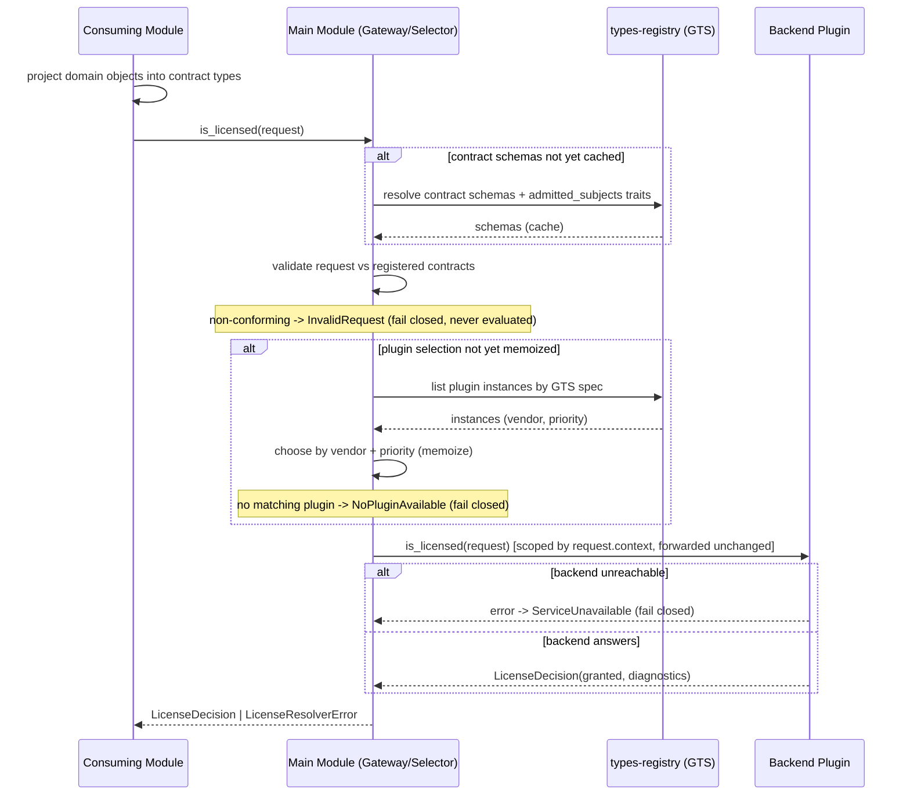

<!-- cpt:
version: 1.0.0
status: draft
module: license-resolver
system: cf
-->

# Technical Design — License Resolver

<!-- toc -->

- [1. Architecture Overview](#1-architecture-overview)
  - [1.1 Architectural Vision](#11-architectural-vision)
  - [1.2 Architecture Drivers](#12-architecture-drivers)
  - [1.3 Architecture Layers](#13-architecture-layers)
- [2. Principles & Constraints](#2-principles--constraints)
  - [2.1 Design Principles](#21-design-principles)
  - [2.2 Constraints](#22-constraints)
- [3. Technical Architecture](#3-technical-architecture)
  - [3.1 Domain Model](#31-domain-model)
  - [3.2 Component Model](#32-component-model)
  - [3.3 API Contracts](#33-api-contracts)
  - [3.4 Internal Dependencies](#34-internal-dependencies)
  - [3.5 External Dependencies](#35-external-dependencies)
  - [3.6 Interactions & Sequences](#36-interactions--sequences)
  - [3.7 Database schemas & tables](#37-database-schemas--tables)
  - [3.8 Deployment Topology](#38-deployment-topology)
- [4. Additional context](#4-additional-context)
- [5. Traceability](#5-traceability)

<!-- /toc -->

- [ ] `p3` - **ID**: `cpt-cf-license-resolver-design-overview`

## 1. Architecture Overview

### 1.1 Architectural Vision

License Resolver is a thin, read-only, plugin-delegating system module. It answers exactly one question — *is this
resource licensed to this subject right now?* — through a single `is_licensed(request)` check, where the
`LicenseCheckRequest` bundles the subject and resource contract objects (each with schematized `metadata`) and the
tenant context, and returns a yes/no decision plus a structured, non-authoritative `diagnostics` map (debug info about
how the decision was reached). It owns no grant store: grant facts live in heterogeneous, vendor-owned backends, so the
main module discovers and selects a backend plugin at runtime via the GTS types registry (by vendor + priority) and
delegates the lookup. This mirrors the proven `authz-resolver` / `tenant-resolver` delegation model and keeps issuance,
billing, storage, and catalog/listing concerns out of the resolver.

The architecture is deliberately minimal: a three-crate triad (SDK contract, main-module gateway/selector, backend
plugin) over the ToolKit framework. The check payload is a **typed licensing contract**: the Subject and Resource in a
request are instances of registered GTS types derived from the licensing base types
(`gts.cf.core.lic.subj.v1~` / `…res.v1~`) — a module that wants license enforcement registers its derived Subject and
Resource types (its published licensing surface) and *projects* the licensing-relevant slice of its domain objects
into them; this module owns only the base types and MAY provide helpers for registering the well-known
`SecurityContext` subjects (`user`, `tenant`). Inside the contract objects,
identity is the domain GTS type (always present) plus an optional instance id — a well-known name or a UUID; without
the id the check targets the whole resource type (e.g. on a `POST`, before any instance exists). The gateway validates
every request against the registered contracts (schemas + admitted subject types) before delegating; what the
properties *mean* and what is *licensable* remain the backend licensing service's concern. Because the resolver
performs no writes and holds no state, it is stateless and side-effect-free; the behavioral guarantees that shape the
design are tenant scoping via the request's tenant context (derived from the caller's `SecurityContext`), fail-closed
semantics when no plugin or backend is reachable, and fail-closed rejection of non-conforming requests.

### 1.2 Architecture Drivers

Requirements from PRD that significantly influence architecture decisions.

#### Functional Drivers

| Requirement                                           | Design Response                                                                                                                                                                                                                                                                                                                                                                                                               |
|-------------------------------------------------------|-------------------------------------------------------------------------------------------------------------------------------------------------------------------------------------------------------------------------------------------------------------------------------------------------------------------------------------------------------------------------------------------------------------------------------|
| `cpt-cf-license-resolver-fr-is-licensed-check`        | A single `is_licensed` method on the public `LicenseResolverClient` contract (`cpt-cf-license-resolver-component-sdk-contract`); the main-module gateway (`cpt-cf-license-resolver-component-main-gateway`) realizes it by delegating to the selected plugin.                                                                                                                                                                 |
| `cpt-cf-license-resolver-fr-subject-identity`         | The Subject is an instance of a derived Subject contract type (§3.1): domain GTS type (required) + optional id + schematized `metadata`; carried into the check and propagated to the plugin.                                                                                                                                                                                                                                 |
| `cpt-cf-license-resolver-fr-resource-identity`        | The Resource is an instance of a derived Resource contract type (§3.1): domain GTS type (required) + optional instance id + schematized `metadata`; without the id the check targets the whole type, with it a specific resource; principle `cpt-cf-license-resolver-principle-gts-typed-resource-identity`.                                                                                                                  |
| `cpt-cf-license-resolver-fr-contract-registration`    | Licensing base types owned by this module, defined in its SDK contract crate (§3.1, §3.2); a module that wants license enforcement registers its derived Subject and Resource types in the types registry — its published licensing surface; this module MAY provide helpers for registering the well-known `SecurityContext` subjects (`user`, `tenant`); principle `cpt-cf-license-resolver-principle-validated-contracts`. |
| `cpt-cf-license-resolver-fr-contract-discoverability` | Derived contract types are enumerable from the types registry by derivation from the base types (§3.1); no resolver API is involved — discoverability is registry-native.                                                                                                                                                                                                                                                     |
| `cpt-cf-license-resolver-fr-request-validation`       | Gateway validation pipeline (§3.2, §3.6): structural (contract schemas, identity invariants) + compatibility (`admitted_subjects` trait) ahead of delegation; failures map to `InvalidRequest` (§3.3), never to a not-granted decision.                                                                                                                                                                                       |
| `cpt-cf-license-resolver-fr-contract-compatibility`   | Additive optional properties are non-breaking (consumers ignore unknown fields); removals/renames/type changes/narrowing of admitted subjects require a new contract version (§3.1, §3.3 breaking-change policy).                                                                                                                                                                                                             |
| `cpt-cf-license-resolver-fr-evaluation-metadata`      | `metadata` lives on the Subject/Resource contract objects (§3.1, §3.3); shape-validated against the registered contract schema, semantically uninterpreted by the gateway, forwarded unchanged to the plugin, which MAY evaluate attribute constraints (region, model, …).                                                                                                                                                    |
| `cpt-cf-license-resolver-fr-plugin-delegation`        | Gateway/selector component discovers plugins via the types registry and routes by vendor + priority; principle `cpt-cf-license-resolver-principle-delegate-dont-store`.                                                                                                                                                                                                                                                       |
| `cpt-cf-license-resolver-fr-read-only`                | No write paths, no store, no list method anywhere in the contract; principles `cpt-cf-license-resolver-principle-read-only` and `cpt-cf-license-resolver-principle-check-only-no-listing`.                                                                                                                                                                                                                                    |

#### NFR Allocation

| NFR ID                                       | NFR Summary                                                 | Allocated To                                                        | Design Response                                                                                                                                                                                                                                                                                                                                                                  | Verification Approach                                                                      |
|----------------------------------------------|-------------------------------------------------------------|---------------------------------------------------------------------|----------------------------------------------------------------------------------------------------------------------------------------------------------------------------------------------------------------------------------------------------------------------------------------------------------------------------------------------------------------------------------|--------------------------------------------------------------------------------------------|
| `cpt-cf-license-resolver-nfr-read-latency`   | `is_licensed` ≤ 50ms p95 at the resolver boundary           | Gateway/selector (`cpt-cf-license-resolver-component-main-gateway`) | Plugin instance selection is memoized after first resolution and contract schemas are resolved from the registry once and cached, so the hot path is a cached-schema validation, a scoped ClientHub lookup, and one delegated call; boundary excludes plugin compute.                                                                                                            | Boundary latency benchmark at p95 excluding plugin processing.                             |
| `cpt-cf-license-resolver-nfr-fail-closed`    | Never grant by default when no plugin / backend unreachable | Gateway/selector + `LicenseResolverError` mapping                   | No matching plugin yields `NoPluginAvailable`; an unreachable backend yields `ServiceUnavailable`; neither path can produce a granted decision (principle `cpt-cf-license-resolver-principle-fail-closed-no-plugin`).                                                                                                                                                            | Tests asserting 0 grant-by-default outcomes across all no-plugin / unavailable conditions. |
| `cpt-cf-license-resolver-nfr-tenant-scoping` | Every resolution scoped to the request's tenant context     | All components                                                      | Current model: every license is tenant-bounded — regardless of subject type the subject belongs to a tenant. The `LicenseCheckRequest` carries a tenant context (built by the caller from its `SecurityContext`); the gateway scopes by it and forwards the request unchanged to the plugin; tenant scope is derived solely from `request.context` (no cross-tenant resolution). | Tests asserting 0 cross-tenant resolutions.                                                |

#### Key ADRs

| ADR ID                                                  | Decision Summary                                                                                                                                                                                                                                                          |
|---------------------------------------------------------|---------------------------------------------------------------------------------------------------------------------------------------------------------------------------------------------------------------------------------------------------------------------------|
| `cpt-cf-license-resolver-adr-gts-resource-identity`     | Inside the contract objects, subject/resource identity is the domain GTS type (required) plus an optional instance id (name or UUID) — without the id the check targets a whole resource type (e.g. on `POST`); how an id-less check is answered is the backend's policy. |
| `cpt-cf-license-resolver-adr-typed-licensing-contracts` | Subject/Resource shapes are registered, versioned GTS types derived from the licensing base types; the gateway validates every request against the registered contracts (fail-closed) before delegation; metadata is schematized but semantically opaque to the engine.   |
| `cpt-cf-license-resolver-adr-plugin-delegation`         | No resolver-owned store; backend discovered via types-registry and selected by vendor + priority, failing closed when none matches.                                                                                                                                       |

### 1.3 Architecture Layers

```text
+-----------------------------------------------------------+
|  Consuming module (caller)                                |
| builds LicenseCheckRequest(subject, resource, metadata, ctx)|
+----------------------------+------------------------------+
                             | LicenseResolverClient.is_licensed
                             v
+-----------------------------------------------------------+
|  SDK contract crate  (LicenseResolverClient,              |
|    LicenseResolverPluginClient, DTOs, error enum, GTS)    |
+----------------------------+------------------------------+
                             v
+-----------------------------------------------------------+
|  Main module (gateway / selector)                         |
|    discovers + selects plugin, delegates, maps errors     |
+------------------+----------------------+-----------------+
                   | types-registry (GTS) | scoped ClientHub
                   v                      v
+---------------------------+   +---------------------------+
|  types-registry (GTS)     |   |  Backend plugin           |
|    plugin discovery       |   |    validates + holds      |
|    (vendor + priority)    |   |    grants, answers check  |
+---------------------------+   +---------------------------+
```

- [ ] `p3` - **ID**: `cpt-cf-license-resolver-tech-layers`

| Layer                     | Responsibility                                                                                         | Technology               |
|---------------------------|--------------------------------------------------------------------------------------------------------|--------------------------|
| Contract (SDK)            | Public + plugin traits, DTOs, error enum, plugin GTS spec                                              | Rust, ToolKit SDK, GTS   |
| Application (main module) | Contract validation, plugin discovery/selection, delegation, error mapping, tenant propagation         | Rust, ToolKit, ClientHub |
| Domain                    | Licensing base + derived contract types, `Subject`/`Resource` contract objects, `LicenseDecision`      | Rust, GTS                |
| Integration               | Plugin discovery / selection (vendor + priority); contract registration and schema resolution (cached) | types-registry (GTS)     |

## 2. Principles & Constraints

### 2.1 Design Principles

#### Read-Only / No Issuance

- [ ] `p2` - **ID**: `cpt-cf-license-resolver-principle-read-only`

The resolver only evaluates a check. It never issues, revokes, bills, manages, or stores grants, and its public contract
exposes no such operation. This is a property of the resolver only — a backend plugin behind the delegation boundary may
itself be backed by mutable systems (issuance, billing); how it sources or maintains grants is its own concern. Write
and lifecycle concerns stay out of the resolver, keeping the contract narrow and authoritative.

**ADRs**: `cpt-cf-license-resolver-adr-plugin-delegation`

#### Check-Only / No Listing

- [ ] `p2` - **ID**: `cpt-cf-license-resolver-principle-check-only-no-listing`

The resolver answers a point-in-time question about ONE concrete resource and subject. Enumerating "everything licensed
to a subject" is a catalog/query concern, so there is no list operation and no pagination — there is exactly one
`is_licensed` method.

**ADRs**: `cpt-cf-license-resolver-adr-plugin-delegation`

#### GTS-Typed Identity

- [ ] `p2` - **ID**: `cpt-cf-license-resolver-principle-gts-typed-resource-identity`

Inside the Subject/Resource contract objects, identity is the domain GTS type (`GtsTypeId`, `…type.v1~`, always
present) plus an optional instance id — a stable well-known name or a UUID. Without the id the check targets
the whole resource type; with it, a specific instance. The domain types are externally owned: the resolver references
them and validates their presence/form, while which types are licensable — and how an id-less check is answered — is
the backend licensing service's policy.

**ADRs**: `cpt-cf-license-resolver-adr-gts-resource-identity`

#### Typed, Validated Licensing Contracts

- [ ] `p2` - **ID**: `cpt-cf-license-resolver-principle-validated-contracts`

Every Subject/Resource shape in a check is a registered, versioned GTS type derived from the licensing base types —
never an ad-hoc payload. The gateway validates each request against the registered contracts (schemas + admitted
subject types) before delegation and rejects non-conforming requests fail-closed, distinct from a not-granted decision.
The engine validates *shape and compatibility* only; it never interprets what properties mean or decides
licensability — semantics stay with the backend. This is what makes the licensing surface observable and governable by
platform vendors.

**ADRs**: `cpt-cf-license-resolver-adr-typed-licensing-contracts`

#### Delegate, Don't Store

- [ ] `p2` - **ID**: `cpt-cf-license-resolver-principle-delegate-dont-store`

Grant facts live in heterogeneous vendor backends. The main module discovers a backend plugin via the types registry and
delegates the lookup; it holds no grant store of its own, so backends can be added or swapped without caller changes.

**ADRs**: `cpt-cf-license-resolver-adr-plugin-delegation`

#### Fail Closed on No Plugin

- [ ] `p2` - **ID**: `cpt-cf-license-resolver-principle-fail-closed-no-plugin`

When no matching plugin is available or the backend is unreachable, the resolver fails closed: it returns a not-granted
decision or an error and never grants by default. Granting when the authority cannot be reached would be a
license/security violation.

**ADRs**: `cpt-cf-license-resolver-adr-plugin-delegation`

### 2.2 Constraints

#### ToolKit Framework

- [ ] `p2` - **ID**: `cpt-cf-license-resolver-constraint-toolkit-framework`

The module is built on the ToolKit framework and follows the SDK / main-module / plugin triad. Inter-module
communication uses SDK clients and the ClientHub; plugins are consumed only through the main module's public contract,
never directly.

**ADRs**: `cpt-cf-license-resolver-adr-plugin-delegation`

#### GTS via Types Registry

- [ ] `p2` - **ID**: `cpt-cf-license-resolver-constraint-gts-via-types-registry`

Plugin discovery and licensing contracts go exclusively through the GTS types registry: plugins are described by a
versioned GTS plugin spec and selected by vendor + priority; licensing contract types (base + derived) are registered
there and their schemas resolved (and cached) from there. The `admitted_subjects` constraint is expressed as a GTS
trait (`x-gts-traits`) on derived Resource types. Domain types are referenced by GTS type path; which types are
licensable is owned by the backend licensing service, not the resolver core.

**ADRs**: `cpt-cf-license-resolver-adr-gts-resource-identity`, `cpt-cf-license-resolver-adr-typed-licensing-contracts`

## 3. Technical Architecture

### 3.1 Domain Model

**Technology**: a registry-resident GTS **contract type** (the durable domain entity), instantiated by transport-agnostic
Rust **value objects** (the SDK models passed in and out of a check).

**Core Entities**:

| Entity                | Description                                                                                                                                                                                                                                                                                                                                           |
|-----------------------|-------------------------------------------------------------------------------------------------------------------------------------------------------------------------------------------------------------------------------------------------------------------------------------------------------------------------------------------------------|
| Licensing Contract    | The durable domain entity: a registered, versioned GTS type derived from a licensing base type, with identity (its GTS type id) and its own version + compatibility lifecycle. Defines a Subject or Resource shape — required domain `type`, optional `id`, a `metadata` schema; a Resource contract also declares its `admitted_subjects`. Lives in the types registry; the value objects below are its instances (base/derived schemas detailed under *Licensing base types* / *Derived types*). |
| `LicenseCheckRequest` | The single input to a check — bundles the `subject` and `resource` contract objects and `context`; the contract's growth surface (new inputs are added as fields, not new parameters).                                                                                                                                                                |
| `Subject`             | An instance of a derived Subject contract type (base `gts.cf.core.lic.subj.v1~`): domain GTS type (required), optional id, `metadata` conforming to the contract schema. Polymorphic — a tenant, a user, or any future subject type; not restricted to tenants.                                                                                       |
| `Resource`            | An instance of a derived Resource contract type (base `gts.cf.core.lic.res.v1~`): domain GTS type (required), optional instance id, `metadata` conforming to the contract schema. Without the id the check targets the whole resource type; with it, a specific resource. Passed to the backend plugin unchanged.                                     |
| `LicenseCheckContext` | The request's tenant context — the tenant isolation scope, which the caller derives from its `SecurityContext` (as authz-resolver does). Minimal today (tenant scope); the extension point for future contextual evaluation semantics (e.g. whether hierarchy traversal is allowed), mirroring how authz models such cases.                           |
| `LicenseDecision`     | The check result: a `granted` boolean plus a `diagnostics` map (string → JSON) of non-authoritative debug info about how the decision was reached (e.g. backend id, matched grant, denial cause). Carrying minimal grant metadata (e.g. status) is a possible future enrichment (PRD §13 open question; DESIGN §4), not part of the current decision. |

**Licensing base types** (owned by this module, under `gts.cf.core.lic.*`):

`gts.cf.core.lic.subj.v1~` — base Subject type:

| Field      | Type                               | Notes                                                       |
|------------|------------------------------------|-------------------------------------------------------------|
| `type`     | GTS type id, **required**          | The subject's domain type (e.g. a user type)                |
| `id`       | optional — UUID or well-known name | Absent for type-level subjects                              |
| `metadata` | object                             | Subject properties, conforming to the derived type's schema |

`gts.cf.core.lic.res.v1~` — base Resource type:

| Field                       | Type                               | Notes                                                                                       |
|-----------------------------|------------------------------------|---------------------------------------------------------------------------------------------|
| `type`                      | GTS type id, **required**          | The resource's domain type                                                                  |
| `id`                        | optional — UUID or well-known name | Absent = whole-type check (e.g. on `POST`); how it is answered is the backend's policy      |
| `metadata`                  | object                             | Resource properties, conforming to the derived type's schema                                |
| *trait* `admitted_subjects` | set of Subject contract types      | The `gts.cf.core.lic.subj.v1~*` types this Resource may be checked against (`x-gts-traits`) |

**Derived types — a Gear's licensing surface** (example, LLM gateway):

- Subject `gts.cf.core.lic.subj.v1~cf.genai.llm_gateway.user.v1~` — `metadata: { category: string }`
- Resource `gts.cf.core.lic.res.v1~cf.genai.llm_gateway.model_usage.v1~` —
  `metadata: { model_vendor: string, model_name: string }`,
  `admitted_subjects: [gts.cf.core.lic.subj.v1~cf.genai.llm_gateway.user.v1~*]`

Because all contracts derive from the base types, querying the registry for everything under
`gts.cf.core.lic.subj.v1~` / `…res.v1~` yields the complete licensing surface of a platform — every check, every
Subject/Resource pair, every property available for rules — with no surrounding type noise. A platform vendor that
licenses per-model writes rules over `model_vendor`/`model_name`; one that does not, ignores those fields. Same Gear,
same contract, different licensing models.

**Identity forms inside a contract object** — the domain GTS type is always present; the instance id is optional:

- Whole resource type (no instance id): type only, e.g. `gts.cf.<pkg>.content.v1~` — asks whether the subject is
  entitled to resources of this type as a class; typically gating creation (e.g. a `POST`), where the resource does not
  exist yet so there is no id to pass. What a type-level grant means is the backend's definition; a caller that needs a
  pre-creation check distinguished from other type-level checks signals it via a `metadata` property of its contract
  schema.
- Named instance: type plus a stable well-known name (e.g. a named feature).
- Opaque instance: type plus a UUID (e.g. a content item).

Both fields are forwarded to the backend plugin unchanged; it interprets them to answer the check — see
`cpt-cf-license-resolver-adr-gts-resource-identity`.

**Relationships**:

- `LicenseCheckRequest` is the single input to a check — it bundles the `Subject` and `Resource` contract objects and
  the `LicenseCheckContext` (tenant scope); `LicenseDecision` is its output.
- Base types are owned by this module's SDK; the derived Subject and Resource contract types are registered by the
  module that wants license enforcement (this module MAY provide helpers for registering the well-known
  `SecurityContext` subjects, `user`/`tenant`); the domain types
  referenced inside (`type` fields) are owned by external modules — the resolver validates contract conformance but
  never defines domain types or decides licensability (the backend licensing service does).
- There is intentionally NO `Page<T>` and NO `LicensedResource` entity — the resolver does not list or enumerate.

### 3.2 Component Model

```text
            LicenseResolverClient.is_licensed
   caller ------------------------------------> [Main module: gateway/selector]
                                                   |  1. validates request vs registered
                                                   |     contracts (schemas + admitted
                                                   |     subjects; cached from registry)
                                                   |  2. discovers via types-registry (GTS)
                                                   |     and selects by vendor + priority
                                                   v
                              get_scoped::<LicenseResolverPluginClient>
                                                   |
                                                   v
                                          [Backend plugin]
                                            holds grant facts
   (SDK contract crate defines both traits, the licensing base types, DTOs,
    error enum, and the plugin GTS spec)
```

#### SDK Contract

- [ ] `p2` - **ID**: `cpt-cf-license-resolver-component-sdk-contract`

- **Why**: Provides the stable, transport-agnostic contract shared by callers and plugins so neither depends on the
  other's internals.
- **Responsibility scope**: Defines the public `LicenseResolverClient` trait and the `LicenseResolverPluginClient`
  trait (both with the single `is_licensed` method), the licensing base types
  (`gts.cf.core.lic.subj.v1~` / `…res.v1~`, incl. the `admitted_subjects` trait schema), optionally helpers that other
  modules use to register the well-known `SecurityContext`-derived Subject types (`user`, `tenant`), the DTOs
  (`Subject` / `Resource` contract objects, `LicenseCheckContext`, `LicenseDecision`), the `LicenseResolverError` enum,
  and the GTS plugin spec used for discovery.
- **Responsibility boundaries**: Holds no logic, no state, and no plugin selection; defines no domain types (externally
  owned) and registers no derived contract types itself (those are registered by the modules that want license
  enforcement); exposes no listing/enumeration method.
- **Related components**: `cpt-cf-license-resolver-component-main-gateway` — implemented-by (gateway implements the
  public trait); `cpt-cf-license-resolver-component-plugin` — implemented-by (plugin implements the plugin trait).

#### Main-Module Gateway / Selector

- [ ] `p2` - **ID**: `cpt-cf-license-resolver-component-main-gateway`

- **Why**: Realizes the public contract while keeping callers decoupled from any specific backend, centralizing plugin
  discovery, selection, delegation, and fail-closed error mapping.
- **Responsibility scope**: Implements `LicenseResolverClient`; receives a `LicenseCheckRequest`, scopes by its
  `context` (tenant), **validates the request against the registered contracts** — structural (contract schemas,
  domain-type presence) and compatibility (`admitted_subjects` trait), with schemas resolved from the types registry
  and cached — then discovers plugin instances via the plugin GTS spec, selects one by vendor + priority (memoizing the
  selection), resolves the scoped plugin client via ClientHub, propagates the `LicenseCheckRequest` unchanged,
  delegates the `is_licensed` check, and maps validation and plugin/registry failures to the canonical
  `LicenseResolverError`.
- **Responsibility boundaries**: Owns no grant store and makes no licensing decision itself — it validates shape and
  routes; it never interprets what contract properties *mean* and never decides licensability (`metadata` and identity
  fields are shape-validated, then passed through unchanged to the plugin, which owns the licensable-type catalog and
  grant semantics); a
  non-conforming request maps to a validation error (fail-closed), never to a not-granted decision; never grants by
  default (a missing plugin or unreachable backend maps to a non-granting error); performs no listing.
- **Related components**: `cpt-cf-license-resolver-component-sdk-contract` — depends on (implements its public trait);
  `cpt-cf-license-resolver-component-plugin` — calls (delegates the check via the scoped plugin client).

#### Backend Plugin

- [ ] `p2` - **ID**: `cpt-cf-license-resolver-component-plugin`

- **Why**: A license enforcement/management service that encapsulates a vendor-specific source of grant facts behind the
  shared plugin trait so backends are swappable without caller changes.
- **Responsibility scope**: Registers its GTS instance (vendor + priority metadata) and a scoped client; receives only
  requests that conform to a registered contract; owns the catalog of licensable resource types and grant semantics
  (interpreting the contract objects' domain type and optional id — without the id, a whole-type check whose answer is
  the backend's policy; with the id, a specific resource); MAY evaluate the forwarded contract `metadata` to apply
  attribute/constraint-based licensing (region, model, …); holds/queries grant facts; and answers the delegated
  `is_licensed` check for the given subject within the tenant isolation scope carried in `request.context`.
- **Responsibility boundaries**: Never consumed directly by other modules — only through the main module's public
  contract; does not define the domain types (owned by their modules) or the derived contract types (registered by the
  consuming Gears); MUST ignore contract properties it does not use (additive compatibility); exposes no listing
  method.
- **Related components**: `cpt-cf-license-resolver-component-sdk-contract` — depends on (implements its plugin trait);
  `cpt-cf-license-resolver-component-main-gateway` — called-by (receives delegated checks).

### 3.3 API Contracts

The module exposes one public client trait and requires one plugin trait, described in prose only (no code).

- **Public interface (PRD)**: `cpt-cf-license-resolver-interface-client`
- **Plugin contract (PRD)**: `cpt-cf-license-resolver-contract-plugin`
- **Technology**: Rust traits over the ToolKit ClientHub (in-process); transport-agnostic SDK models.

**Public client — `LicenseResolverClient`** (realizes PRD `cpt-cf-license-resolver-interface-client`): exposes the
single method `is_licensed(request: LicenseCheckRequest) -> LicenseDecision`. `LicenseCheckRequest` bundles `subject`
and `resource` — instances of registered derived licensing contract types, each carrying the domain GTS type
(required), an optional id, and schematized `metadata` (shape-validated, semantically uninterpreted, forwarded to the
plugin) — and `context` (a `LicenseCheckContext` carrying the tenant scope). The caller builds `context` from its
`SecurityContext`, exactly as authz-resolver's `PolicyEnforcer` builds an `EvaluationRequest` — the resolver method
itself takes no separate `SecurityContext`. There is no listing or enumeration method.

**Plugin client — `LicenseResolverPluginClient`** (realizes PRD `cpt-cf-license-resolver-contract-plugin`): mirrors the
public signature with the same single `is_licensed` method, discovered via the GTS types-registry plugin spec and
resolved as a scoped client. It tracks the public contract's major version.

**Operation summary**:

| Operation     | Inputs                                                                      | Output                                        | Stability |
|---------------|-----------------------------------------------------------------------------|-----------------------------------------------|-----------|
| `is_licensed` | `LicenseCheckRequest` (subject + resource contract objects, tenant context) | `LicenseDecision` (granted + diagnostics map) | stable    |

**Error model — `LicenseResolverError`**: the SDK returns this typed enum. It also provides a **default mapping** of
each variant to a canonical RFC-9457 error (`Problem`) — the table below — but whether to apply that mapping is the
**caller's** responsibility: a caller may surface the canonical `Problem` as-is, or match on the typed variant and
handle it its own way. Canonical categories and their GTS error type ids come from the platform error catalog
(`toolkit-canonical-errors`).

| Variant                      | Meaning                                                                                                                | Default canonical error — GTS error type id                                            |
|------------------------------|------------------------------------------------------------------------------------------------------------------------|----------------------------------------------------------------------------------------|
| `Unauthorized`               | Caller/subject not permitted to perform the check                                                                      | `PermissionDenied` — `gts.cf.core.errors.err.v1~cf.core.err.permission_denied.v1~`     |
| `InvalidRequest(violations)` | Request does not conform to its registered contracts (schema mismatch, missing domain type, subject type not admitted) | `InvalidArgument` — `gts.cf.core.errors.err.v1~cf.core.err.invalid_argument.v1~`       |
| `NoPluginAvailable`          | No backend plugin matches the resource type / vendor                                                                   | `Internal` — `gts.cf.core.errors.err.v1~cf.core.err.internal.v1~`                      |
| `ServiceUnavailable(reason)` | Selected backend unreachable or erroring                                                                               | `ServiceUnavailable` — `gts.cf.core.errors.err.v1~cf.core.err.service_unavailable.v1~` |
| `Internal(reason)`           | Unexpected internal failure                                                                                            | `Internal` — `gts.cf.core.errors.err.v1~cf.core.err.internal.v1~`                      |

A negative result is **not** an error — it is `LicenseDecision { granted: false }`. The error enum covers only
"cannot-determine" conditions; on any of them the caller fails closed (treats the outcome as not-granted). A contract
violation is an `InvalidRequest` error, never a not-granted decision — an invalid check silently evaluated would be an
unauditable check. A request declaring a contract type that is **not registered** is likewise `InvalidRequest`; the
registry being **unreachable** with no cached schema is `ServiceUnavailable` (cannot-determine, fail closed). Being
read-only, there are no mutation / "not found" write errors.

### 3.4 Internal Dependencies

| Dependency Module   | Interface Used                        | Purpose                                                                                                                                                         |
|---------------------|---------------------------------------|-----------------------------------------------------------------------------------------------------------------------------------------------------------------|
| `types-registry`    | SDK client (`TypesRegistryClient`)    | Discover and select backend plugin instances by GTS plugin spec (vendor + priority); resolve licensing contract schemas and `admitted_subjects` traits (cached) |
| ToolKit `ClientHub` | scoped client registration/resolution | Resolve the selected plugin as a scoped `LicenseResolverPluginClient`                                                                                           |

**Dependency Rules** (per project conventions):

- No circular dependencies; the main module depends on `types-registry` but not on any plugin crate.
- Always use SDK clients / scoped ClientHub for inter-module communication.
- Plugins are consumed only through the main module's public contract.
- The `LicenseCheckRequest` (including its tenant context) is propagated unchanged across all in-process calls.

### 3.5 External Dependencies

The resolver integrates with no external systems, databases, or third-party services directly. Backend grant sources are
reached only via the discovered plugin component, which is responsible for any external integration it requires. There
is no resolver-owned external dependency.

### 3.6 Interactions & Sequences

#### License Check (is_licensed)

**ID**: `cpt-cf-license-resolver-seq-is-licensed`

**Use cases**: `cpt-cf-license-resolver-usecase-gate-access`

**Actors**: `cpt-cf-license-resolver-actor-consuming-module`, `cpt-cf-license-resolver-actor-backend-plugin`



**Description**: The consuming module projects its domain objects into instances of the registered contract types and
calls the check. The gateway validates the request against the registered contracts (schemas resolved from the types
registry and
cached; structural conformance plus `admitted_subjects` compatibility) — a non-conforming request is rejected as
`InvalidRequest` without ever reaching a plugin. It then resolves and memoizes the backend plugin via the types
registry (selecting by vendor + priority) and delegates the single `is_licensed` check, forwarding the
`LicenseCheckRequest` unchanged (tenant scope comes from `request.context`). A missing plugin or unreachable backend
fails closed to a non-granting error. No listing or enumeration sequence exists.

### 3.7 Database schemas & tables

Not applicable because the resolver is read-only and stateless: it owns no grant store and persists nothing. All grant
data lives in the backend plugin.

### 3.8 Deployment Topology

Not applicable because the resolver is read-only and stateless: it is an in-process library module with no dedicated
infrastructure, datastore, or network topology of its own.

## 4. Additional context

**Telemetry**: The resolver's own telemetry surface is minimal — a check counter, a boundary latency histogram, and a
validation-failure counter. Dimension them only by bounded labels (the contract type, the domain type, selected vendor,
decision outcome, violation kind); never label by instance ids or `metadata` values (unbounded cardinality). Boundary
latency excludes plugin compute to support NFR `cpt-cf-license-resolver-nfr-read-latency`. (Backend plugins' own
telemetry is their concern.)

**Future considerations**: Contract `metadata` (`cpt-cf-license-resolver-fr-evaluation-metadata`) is the contract's
primary extension point — future attribute/constraint dimensions (region, country, environment, …) arrive as new
optional schema fields on derived contract types, non-breaking per
`cpt-cf-license-resolver-fr-contract-compatibility`, with no signature change. Deployment-wide evaluation attributes
sourced from configuration (rather than per-call code) are a candidate SDK-level convenience, provided merged
properties conform to the registered contract schema. Likewise a conventional `diagnostics` key vocabulary and optional
grant metadata (status/expiry) on `LicenseDecision` may be enriched without changing the single-operation shape. Any
such change follows the breaking-change policy on the public contract.

## 5. Traceability

- **PRD**: [PRD.md](./PRD.md)
- **ADRs**: [ADR/](./ADR/)

| PRD ID                                                | Type | DESIGN Section(s)            | Backing ADR                                             |
|-------------------------------------------------------|------|------------------------------|---------------------------------------------------------|
| `cpt-cf-license-resolver-fr-is-licensed-check`        | FR   | §1.2, §3.3, §3.6             | `cpt-cf-license-resolver-adr-plugin-delegation`         |
| `cpt-cf-license-resolver-fr-subject-identity`         | FR   | §1.2, §3.1                   | `cpt-cf-license-resolver-adr-gts-resource-identity`     |
| `cpt-cf-license-resolver-fr-resource-identity`        | FR   | §1.2, §3.1                   | `cpt-cf-license-resolver-adr-gts-resource-identity`     |
| `cpt-cf-license-resolver-fr-contract-registration`    | FR   | §1.2, §2.1, §3.1, §3.2       | `cpt-cf-license-resolver-adr-typed-licensing-contracts` |
| `cpt-cf-license-resolver-fr-contract-discoverability` | FR   | §1.2, §3.1                   | `cpt-cf-license-resolver-adr-typed-licensing-contracts` |
| `cpt-cf-license-resolver-fr-request-validation`       | FR   | §1.2, §2.1, §3.2, §3.3, §3.6 | `cpt-cf-license-resolver-adr-typed-licensing-contracts` |
| `cpt-cf-license-resolver-fr-contract-compatibility`   | FR   | §1.2, §3.1, §4               | `cpt-cf-license-resolver-adr-typed-licensing-contracts` |
| `cpt-cf-license-resolver-fr-evaluation-metadata`      | FR   | §1.2, §3.1, §3.3, §3.6, §4   | `cpt-cf-license-resolver-adr-typed-licensing-contracts` |
| `cpt-cf-license-resolver-fr-plugin-delegation`        | FR   | §1.2, §3.2, §3.4, §3.6       | `cpt-cf-license-resolver-adr-plugin-delegation`         |
| `cpt-cf-license-resolver-fr-read-only`                | FR   | §1.2, §2.1, §3.7             | `cpt-cf-license-resolver-adr-plugin-delegation`         |
| `cpt-cf-license-resolver-nfr-read-latency`            | NFR  | §1.2, §3.2, §4               | `cpt-cf-license-resolver-adr-plugin-delegation`         |
| `cpt-cf-license-resolver-nfr-fail-closed`             | NFR  | §1.2, §2.1, §3.3             | `cpt-cf-license-resolver-adr-plugin-delegation`         |
| `cpt-cf-license-resolver-nfr-tenant-scoping`          | NFR  | §1.2, §3.2, §3.6             | —                                                       |
